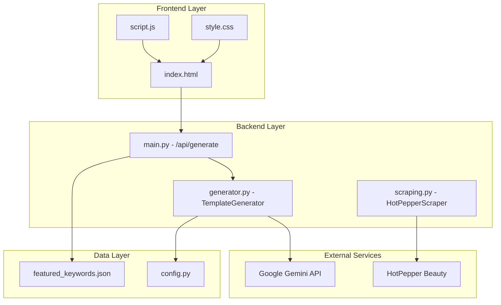

# Design Document

## Overview

Beauty Selection特集キーワード連動機能は、HotPepper Beautyの「Beauty Selection」トレンド情報をアプリケーションに統合し、特集掲載可能性の高いテンプレートを生成する機能です。この機能により、既存のヘアスタイルタイトルジェネレーターを戦略的マーケティング支援ツールへと進化させます。

### 設計原則

1. **既存機能との互換性**: 現在のテンプレート生成フローを維持し、新機能は追加的に実装
2. **データ駆動設計**: 外部JSONファイルによる特集キーワードの管理で、コード変更なしでの更新を実現
3. **段階的フォールバック**: 特集キーワード機能でエラーが発生した場合、通常のテンプレート生成にフォールバック
4. **ユーザビリティ重視**: ワンクリックでの特集キーワード選択と視覚的フィードバック

## Architecture

### システム構成図



### データフロー

1. **特集キーワード表示フロー**
   - アプリ起動時に`featured_keywords.json`を読み込み
   - フロントエンドに特集キーワード一覧を送信
   - ユーザーインターフェースに特集キーワードセクションを表示

2. **特集キーワード選択フロー**
   - ユーザーが特集キーワードをクリック
   - 該当キーワードをメイン入力欄に自動入力
   - 紐づく性別を自動選択
   - 選択状態の視覚的フィードバック

3. **特集対応テンプレート生成フロー**
   - `/api/generate`で特集キーワード判定
   - 特集キーワードの場合、特別なプロンプト指示を追加
   - AIに特集掲載条件を明記した強化プロンプトを送信
   - 特集対応テンプレートを生成・返却

## Components and Interfaces

### 1. データ管理コンポーネント

#### FeaturedKeywordsManager
```python
class FeaturedKeywordsManager:
    def __init__(self, json_path: str = 'app/data/featured_keywords.json'):
        self.json_path = json_path
        self.keywords = []
    
    def load_keywords(self) -> List[Dict]:
        """JSONファイルから特集キーワードを読み込み"""
        
    def is_featured_keyword(self, keyword: str) -> bool:
        """指定されたキーワードが特集キーワードかを判定"""
        
    def get_keyword_info(self, keyword: str) -> Dict:
        """特集キーワードの詳細情報を取得"""
```

#### featured_keywords.json構造
```json
[
  {
    "name": "くびれヘア",
    "keyword": "くびれヘア",
    "gender": "ladies",
    "condition": "スタイル名に『くびれヘア』という文言を必ず含めること。くびれの美しいシルエットを強調した表現を使用すること。"
  },
  {
    "name": "韓国風マッシュ",
    "keyword": "韓国風マッシュ",
    "gender": "mens", 
    "condition": "韓国風のトレンド感を表現し、『韓国風』『マッシュ』のキーワードを含めること。"
  }
]
```

### 2. バックエンドコンポーネント

#### main.py の拡張
```python
# 新規追加する機能
featured_manager = FeaturedKeywordsManager()

@main_bp.route('/api/featured-keywords', methods=['GET'])
def get_featured_keywords():
    """特集キーワード一覧を取得"""
    
async def process_template_generation(keyword: str, gender: str, season: str = None, model: str = 'gemini-2.5-flash') -> list:
    # 特集キーワード判定ロジックを追加
    is_featured = featured_manager.is_featured_keyword(keyword)
    featured_info = featured_manager.get_keyword_info(keyword) if is_featured else None
    
    # TemplateGeneratorに特集情報を渡す
    generator = TemplateGenerator(model_name=model)
    templates = await generator.generate_templates_async(
        titles, keyword, season, gender, 
        featured_info=featured_info
    )
```

#### generator.py の拡張
```python
class TemplateGenerator:
    async def generate_templates_async(
        self, 
        titles: List[str], 
        keyword: str, 
        season: str = None, 
        gender: str = 'ladies',
        featured_info: Dict = None  # 新規追加
    ) -> List[Dict[str, str]]:
        
        prompt = self._create_prompt(titles, keyword, season, gender, featured_info)
        # 既存のロジック継続
        
    def _create_prompt(
        self, 
        titles: List[str], 
        keyword: str, 
        season: str = None, 
        gender: str = 'ladies',
        featured_info: Dict = None  # 新規追加
    ) -> str:
        # 特集キーワード用のプロンプト強化ロジック
        if featured_info:
            featured_instruction = f"""
            
【重要】特集掲載条件の厳守
このキーワードは「Beauty Selection」の特集キーワードです。
以下の条件を絶対に満たすテンプレートを生成してください：

{featured_info['condition']}

この条件を満たさないテンプレートは特集掲載の対象外となるため、
必ず上記の条件を最優先事項として考慮してください。
"""
            # 既存プロンプトに特集指示を挿入
```

### 3. フロントエンドコンポーネント

#### 特集キーワードセクション (index.html)
```html
<!-- キーワード入力欄の近くに追加 -->
<div class="featured-keywords-section">
    <h3 class="featured-keywords-title">
        <i class="fas fa-star"></i>
        今月の特集キーワード
    </h3>
    <div class="featured-keywords-container" id="featured-keywords-container">
        <!-- JavaScriptで動的に生成 -->
    </div>
</div>
```

#### JavaScript機能拡張 (script.js)
```javascript
// 特集キーワード関連の機能
class FeaturedKeywordsManager {
    constructor() {
        this.keywords = [];
        this.selectedKeyword = null;
    }
    
    async loadFeaturedKeywords() {
        // /api/featured-keywordsから取得
    }
    
    renderFeaturedKeywords() {
        // 特集キーワードボタンを生成・表示
    }
    
    selectFeaturedKeyword(keyword) {
        // キーワード自動入力 + 性別自動選択
        // アクティブ状態の視覚的フィードバック
    }
}
```

#### CSS スタイリング (style.css)
```css
.featured-keywords-section {
    background: linear-gradient(135deg, #667eea 0%, #764ba2 100%);
    border-radius: var(--border-radius-lg);
    padding: var(--spacing-lg);
    margin-bottom: var(--spacing-lg);
    color: white;
}

.featured-keyword-btn {
    background: rgba(255, 255, 255, 0.2);
    border: 2px solid rgba(255, 255, 255, 0.3);
    color: white;
    transition: all 0.3s ease;
}

.featured-keyword-btn:hover {
    background: rgba(255, 255, 255, 0.3);
    transform: translateY(-2px);
}

.featured-keyword-btn.active {
    background: rgba(255, 255, 255, 0.9);
    color: var(--primary-color);
    border-color: white;
}
```

## Data Models

### FeaturedKeyword Model
```typescript
interface FeaturedKeyword {
    name: string;           // 表示名（例: "くびれヘア"）
    keyword: string;        // 内部キーワード（例: "くびれヘア"）
    gender: 'ladies' | 'mens';  // 対象性別
    condition: string;      // AI向け掲載条件テキスト
}
```

### Enhanced Template Generation Request
```typescript
interface TemplateGenerationRequest {
    keyword: string;
    gender: 'ladies' | 'mens';
    season?: string;
    model?: string;
    // 内部的に判定される
    isFeatured?: boolean;
    featuredInfo?: FeaturedKeyword;
}
```

### Template Response (既存を拡張)
```typescript
interface TemplateResponse {
    success: boolean;
    templates: Template[];
    isFeatured?: boolean;  // 特集対応テンプレートかを示すフラグ
    status: number;
}
```

## Error Handling

### エラー処理戦略

1. **特集キーワードJSONファイル読み込みエラー**
   - ログに警告を記録
   - 特集キーワード機能を無効化
   - 通常のテンプレート生成は継続

2. **特集キーワード判定エラー**
   - 通常のテンプレート生成にフォールバック
   - エラーログを記録

3. **特集対応プロンプト生成エラー**
   - 通常のプロンプトで生成を継続
   - 警告ログを記録

### エラーハンドリング実装例
```python
class FeaturedKeywordsManager:
    def load_keywords(self) -> List[Dict]:
        try:
            with open(self.json_path, 'r', encoding='utf-8') as f:
                return json.load(f)
        except FileNotFoundError:
            logger.warning(f"特集キーワードファイルが見つかりません: {self.json_path}")
            return []
        except json.JSONDecodeError as e:
            logger.error(f"特集キーワードファイルの形式が不正です: {e}")
            return []
        except Exception as e:
            logger.error(f"特集キーワード読み込みエラー: {e}")
            return []
```

## Testing Strategy

### 1. ユニットテスト

#### test_featured_keywords.py
```python
class TestFeaturedKeywordsManager:
    def test_load_keywords_success(self):
        """正常なJSONファイル読み込みテスト"""
        
    def test_load_keywords_file_not_found(self):
        """ファイル未存在時のフォールバック動作テスト"""
        
    def test_is_featured_keyword(self):
        """特集キーワード判定ロジックテスト"""
        
    def test_get_keyword_info(self):
        """特集キーワード情報取得テスト"""
```

#### test_generator_featured.py
```python
class TestTemplateGeneratorFeatured:
    def test_generate_with_featured_keyword(self):
        """特集キーワードでのテンプレート生成テスト"""
        
    def test_featured_prompt_enhancement(self):
        """特集キーワード用プロンプト強化テスト"""
        
    def test_fallback_on_featured_error(self):
        """特集機能エラー時のフォールバック動作テスト"""
```

### 2. 統合テスト

#### test_featured_integration.py
```python
class TestFeaturedIntegration:
    def test_featured_keywords_api(self):
        """/api/featured-keywords エンドポイントテスト"""
        
    def test_featured_template_generation_flow(self):
        """特集キーワードでの完全な生成フローテスト"""
        
    def test_mixed_featured_normal_keywords(self):
        """特集・通常キーワード混在時の動作テスト"""
```

### 3. フロントエンドテスト

#### test_featured_ui.py
```python
class TestFeaturedUI:
    def test_featured_keywords_display(self):
        """特集キーワードセクション表示テスト"""
        
    def test_keyword_selection_interaction(self):
        """キーワード選択時のUI動作テスト"""
        
    def test_visual_feedback(self):
        """アクティブ状態の視覚的フィードバックテスト"""
```

### 4. パフォーマンステスト

- 特集キーワード読み込み時間の測定
- 特集対応テンプレート生成時間の比較
- 大量の特集キーワード処理時のメモリ使用量測定

### テストデータ

#### test_featured_keywords.json
```json
[
  {
    "name": "テスト用くびれヘア",
    "keyword": "くびれヘア",
    "gender": "ladies",
    "condition": "テスト用の掲載条件です。"
  },
  {
    "name": "テスト用韓国風マッシュ",
    "keyword": "韓国風マッシュ",
    "gender": "mens",
    "condition": "テスト用のメンズ掲載条件です。"
  }
]
```

この設計により、既存のアプリケーション機能を維持しながら、Beauty Selection特集キーワード連動機能を安全かつ効果的に統合できます。段階的なフォールバック機能により、新機能でエラーが発生しても既存の機能は継続して動作し、ユーザーエクスペリエンスを損なうことがありません。